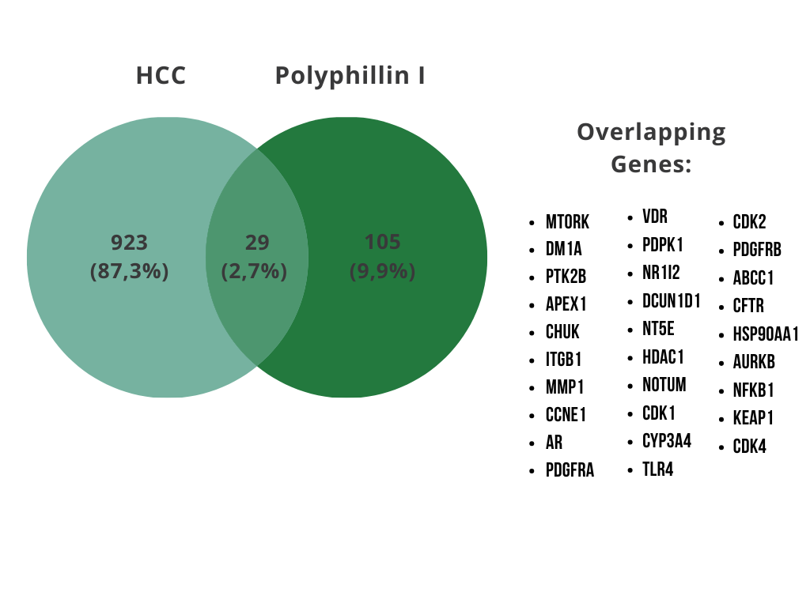

## Laporan Interpretasi Hasil
# Analisis Network Pharmacology Senyawa Polyphillin I Terhadap Hepatocellular Carcinoma

Berdasarkan Chen et al. (2025), Paris polyphilla (dikenal sebagai “Chonglou” dalam pengobatan tradisional Cina) menghasilkan metabolit utama Polyphillin I (PPI) yang berpotensi sebagai antitumor hepatocellular carcinoma (HCC). Mengingat terapi konvensional HCC yang sering terhalang oleh resistensi obat dan efek samping berat, pendekatan network pharmacology digunakan untuk memetakan interaksi multitarget senyawa ini. Analisis ini bertujuan mengidentifikas target genetik utama dari PPI dan mengevaluasi jalur signalisasinya dalam menghambat perkembangan HCC.

Metabolit PPI diidentifikasi melalui PubChem dan diprediksi targetnya menggunakan TargetNet + UniMapping. Daftar gen HCC diperoleh dari OMIM dan GeneCards, kemudian diiriskan dengan target senyawa untuk memperoleh target potensial yang relevan. Protein-Protein Interaction Network (PPI) dari target irisan dikonstruksi melalui STRING (confidence ≥ 0,700) dan dianalisis di Cytoscape untuk visualisasi. Sementara itu, analisis pengayaan Gene Ontology dan KEGG pathway dilakukan terhadap target menggunakan STRING (FDR < 0,05), kemudian hasilnya diintegrasikan dengan jaringan senyawa-target dan PPI menjadi satu visualisasi akhir menggunakan fitur Merge Network pada Cytoscape.

Gambar 1 Irisan gen target HCC dan Polyphillin I

Hasil analisis menggunakan diagram Venn (Gambar 1) berhasil mengidentifikasi 29 gen irisan antara target penyakit HCC dan target molekuler dari senyawa Polyphillin I. Termuan ini mengindikasikan potensi metabolit tersebut dalam memodulasi berbagai jalur biologis yang berperan langsung dalam patofisiologi HCC. Seluruh gen irisan tersebut kemudian dimasukkan ke dalam platform STRING dan dianalisis menggunakan Cytohubba untuk menentukan 10 hub gene utama berdasarkan nilai degree (Tabel 1). Interaksi antara gen-gen tersebut ditunjukkan pada Gambar 2, direpresentasikan oleh 29 node dan 37 edge.

Tabel 1 Nilai degree, betweenness centrality, dan closeness centrality dari 10 hub gen teratashasil analisis jaringan PPI

Gambar 2 Jaringan-jaringan Protein-Protein Interaction (PPI) dari gen irisan hasil konstruksi STRING

Nilai degree menggambarkan jumlah koneksi langsung satu protein dengan protein lainnya. Makin tinggi nilai degree makin banyak protein lain yang berinteraksi dengannya. Betweenness centrality mengukur seberapa sering suatu protein berperan sebagai penghubung antar-jalur sinyal seluler. Closeness centrality menunjukkan seberapa dekat posisi suatu protein terhadap protein dalam jaringan, mencerminkan kecepatan penyebaran sinyal molekuler.

Pada Tabel 1, protein HSP90AA1, MTOR, NFKB1, HDAC1, dan CHUK mencatatkan nilai
degree, betweenness centrality, dan closeness centrality yang paling menonjol dibandingkan protein lainnya. Nilai degree yang tinggi, HSP90AA1 memiliki 8 koneksi dan 4 lainnya masing-masing memiliki 4 koneksi, menunjukkan bahwa gen-gen ini memiliki tingkat interaktivitas fisik terbanyak dalam jaringan PPI. Selain itu, nilai betweenness centrality dan closeness centrality yang dominan menandakan bahwa kelima protein tersebut berfungsi sebagai hub utama yang mengoordinasikan lalu lintas sinyal molekuler. Dengan demikian, gen-gen ini berpotensi menjadi target utama yang menentukan efektivitas dan mekanisme kerja Polyphillin I dalam meredam HCC.

*Gambar 3 Visualisasi jaringan interaksi senyawa-target-pathway*

Gambar 3 merupakan visualisasi jaringan yang menghubungkan senyawa Polyphillin I, gen targen hasil irisan, dan KEGG pathway. Hasil analisis ini menunjukkan bahwa PPI bekerja secara multi- target melalui jalur biologis utama yang saling berkaitan, yaitu Pathways in cancer, PI3K-Akt signalling pathway, dan Hepatitis B. Visualisasi ini juga memperlihatkan bahwa dari 29 gen irisan awal, sebanyak 21 gen target terhubung langsung dengan jalur-jalur utama tersebut dalam jaringan. Ditinjau dari sisi target molekuler, HSP90AA1, MTOR, NFKB1, HDAC1, CHUK, dan kelompok CDK merupakan gen dengan jumlah interaksi terbanyak. Hal ini sejalan dengan profil topologi jaringan PPI pada Tabel 1.

Profil lengkap hasil enrichment analysis Gene Ontology (Biological Process dan Molecular Function) serta KEGG pathway terhadap gen target irisan disajikan pada Gambar 4. Pada kategori Biological process, gen-gen target teridentifikasi terlibat aktif dalam response to hormone, cellular response to oxygen-containing compound, dan protein phosphorylation yang berkaitan erat dengan regulasi pembelahan sel dan transduksi sinyal ekstraseluler. Pada kategori Molecular Function, enrichment terfokus pada cyclin-dependent protein serine/threonine kinase activity dan ATP binding. Hal ini sejalan dengan fungsi kelompok CDK dan HSP90AA1 sebagai hub gene utama pada jaringan PPI. Sementara itu, analisis KEGG pathway pada Gambar 4 menegaskan keterlibatan target pada pathways in cancer, PI3K-Akt signalling pathway, dan Hepatitis B. Ketiga jalur ini merupakan pusat kendali dalam mengontrol proliferasi, kelangsungan hidup (survival), dan respons inflamasi pada jaringan hati.

*Gambar 4 Hasil enrichment analysis Gene Ontology (Biological Process, Molecular Function) dan* KEGG *Pathway* terhadap target irisan

Secara keseluruhan, temuan enrichment analysis memperkuat bukti bahwa senyawa Polyphillin I berpotensi menghambat perkembangan hepatocellular carcinoma melalui tiga mekanisme: memblokir jalur kelangsungan hidup sel (PI3K-Akt), menghentikan progresivitas siklus sel (cell cycle arrest), dan meredam stress peradangan pada hati.

Chen, Y., Wang, Q., Bian, S., Dong, J., Xiong, J., & Le, J. (2025). Exploration of The Mechanism of Polyphyllin I Against Hepatocellular Carcinoma Based on Network Pharmacology, Molecular Docking and Experimental Validation. Discov Onc. 16:941 doi:10.1007/s12672-025-02341- 5

# Diagram Workflow

